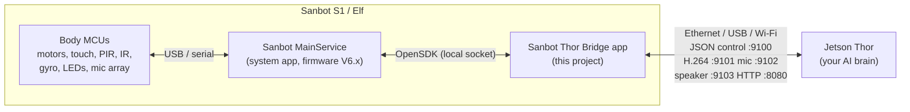

# Sanbot Thor Bridge

This Android app runs on the **Sanbot S1 (Sanbot Elf) head tablet** (Android 6.0.1). It turns the robot into a set of sensors and actuators that an **NVIDIA Jetson Thor** controls over the network. Thor acts as the brain, and the tablet acts as the bridge to the hardware.



## How the tablet talks to the hardware

* The tablet does not drive the motors or read the sensors directly. Qihan's system service (**MainService**, part of the robot firmware) talks to the microcontrollers in the head and body. The firmware is the "Robot version V6.0rc4" in *Settings > About*. The "Robot model: allwinner" line refers to the tablet's Allwinner ARM chipset.
* Apps use the **Sanbot OpenSDK** (`app/libs/SanbotOpenSDK_2.0.1.10.aar`). The SDK gives the app "managers" (`HardWareManager`, `HeadMotionManager`, `WingMotionManager` for the arms, `WheelMotionManager`, `SpeechManager`, `HDCameraManager`, `SystemManager`, and others). These managers talk to MainService.
* **Sanbot only delivers sensor callbacks to the app in the foreground.** Keep this app open on the robot. It keeps the screen on, and it can also start automatically at boot.
* The manifest sets `FORBID_TOUCH`, `FORBID_PIR`, `FORBID_WAKE_RESPONSE` and `RECOGNIZE_MODE=1`. With these set, Sanbot's built-in reactions stay quiet, and Thor gets touch, PIR and speech events instead.

## What the app shows

| Page | Contents |
|---|---|
| **Modules & sensors** | Live HD head-camera preview (SDK, H.264), tablet cameras (Android), microphone level meter, speaker/TTS test. Also every sensor with its live value and age: touch (13 zones), front/back PIR, IR distance, ultrasonic, gyroscope/gravity, obstacle sensors, sound-source angle, speech recognizer, face recognition, battery/charging, buttons, MCU link. |
| **Motors** | State of head pan/tilt, arms, wheels (MCU status, current action, watchdog), motor locks/protection, LEDs/light/projector/face. Manual controls: sliders, hold-to-drive pad, turn-by-angle, move-by-distance. A checkbox controls whether Thor may move the motors. |
| **Connection to Thor** | The tablet's IP addresses per interface (Ethernet / USB tethering / Wi-Fi), a client mode ("connect to Thor IP"), a server mode (Thor connects to the tablet), auto-discovered Thors, token, state rate, active links, and a log. |

The **E-STOP** button on the top bar is always visible. It stops all motion and blocks motion commands from Thor until you release it.

---

## Tutorial 1: Build the APK

1. Install **Android Studio** (any current version, <https://developer.android.com/studio>).
2. Choose **File > Open** and select the `SunBot-Thor` folder. Wait for the Gradle sync to finish. It downloads Gradle 8.7, Android Gradle Plugin 8.5.2 and Android SDK 34 automatically. If Android Studio asks for a Gradle JDK, choose its bundled JDK 17 or newer.
3. Choose **Build > Build App Bundle(s) / APK(s) > Build APK(s)**.
4. The APK is written to `app/build/outputs/apk/debug/app-debug.apk`.

To build from the command line instead, you need JDK 17 and the Android SDK, with `ANDROID_HOME` set:

```powershell
.\gradlew.bat assembleDebug
```

## Tutorial 2: Install the app on the Sanbot tablet

### A. Enable developer mode on the robot

1. On the robot tablet, open **Settings > About**.
2. Tap **"Robot version"** (V6.0rc4) repeatedly, about 7 times, until *"Developer mode open"* appears. If nothing happens, also try tapping *Build number* 7 times; that is the standard Android method.
3. Open **Settings > Developer options** and turn on **USB debugging**.
4. Open **Settings > Security** and enable **Unknown sources**.

### B. Install over USB (recommended)

1. Install the platform tools (`adb`). Android Studio already includes them in `%LOCALAPPDATA%\Android\Sdk\platform-tools`.
2. Connect a USB cable from your PC to the robot's USB port. On the Elf, this port is on the back of the head/neck.
3. Run:
   ```powershell
   adb devices                      # accept the "Allow USB debugging?" prompt on the tablet
   adb install -r -d app\build\outputs\apk\debug\app-debug.apk
   adb shell am start -n com.thorbridge.sanbot/.MainActivity
   ```
   You can also press the green **Run** button in Android Studio while the robot is connected.

### C. Install without a PC cable

Copy `app-debug.apk` to a USB stick or SD card. Open it with the tablet's file manager and tap **Install**.

### D. Start the app

The app appears in the launcher as **Sanbot Thor Bridge**. On some firmware, it is under *APP Market > Come into my life > Purchased APP*. Leave it in the foreground. The *Connection* page lets you enable "Start this app when the robot boots".

---

## Tutorial 3: Connect Thor to the tablet

Every option below works with both connection directions. The simplest setup:

* On the tablet, keep **"Let Thor connect"** enabled (default port 9100).
* On Thor, run `python3 thor/sanbot_bridge.py --tablet <TABLET_IP>`.

The other direction also works. Enable **"Connect to Thor"** on the tablet and enter Thor's IP, then run `python3 thor/sanbot_bridge.py --listen` on Thor. The script also broadcasts a UDP beacon, so Thor shows up in the tablet's list and you can tap it.

The *Connection* page lists every tablet IP. Use it to check which link is up.

### Option 1: Ethernet (preferred): USB-to-Ethernet adapter on the tablet

Android 6 supports USB Ethernet adapters if the kernel has a driver. ASIX AX88772 and Realtek RTL8152/8153 adapters are the most likely to work. Android 6 cannot set a static Ethernet IP from Settings, so **Thor must act as the DHCP server**.

1. Plug the adapter into the robot's USB port (use an OTG adapter or hub if needed). Connect a cable from the adapter to Thor's Ethernet port.
2. On Thor (Ubuntu with NetworkManager), share the port. This gives it the address 192.168.50.1 and starts DHCP automatically:
   ```bash
   ip link                                   # find the Ethernet interface name, e.g. enP2p1s0 / eth0
   sudo nmcli con add type ethernet ifname <IFACE> con-name sanbot \
        ipv4.method shared ipv4.addresses 192.168.50.1/24
   sudo nmcli con up sanbot
   ```
3. On the tablet, `eth0  Ethernet  192.168.50.x` should now appear on the *Connection* page.
4. On Thor, run `python3 thor/sanbot_bridge.py --tablet 192.168.50.x`. Or, in the app, set Thor IP = `192.168.50.1`, press **Connect**, and run `--listen` on Thor.

If no `eth0` appears, run `adb shell ip link` to check. If the kernel has no driver for your adapter, use option 2 or 3. Both are also wired.

### Option 2: USB tethering (wired, no adapter)

1. Connect a USB cable from the robot to Thor.
2. On the tablet, turn on **Settings > More > Tethering & portable hotspot > USB tethering** (the app's *Network settings* button opens this screen).
3. Thor gets an address like `192.168.42.x` on a new `usb0`/`enx...` interface. The tablet is usually `192.168.42.129`; the *Connection* page shows it as `rndis0`.
4. On Thor, run `python3 thor/sanbot_bridge.py --tablet 192.168.42.129`.

### Option 3: ADB port forwarding over USB (wired, zero configuration)

With USB debugging enabled and the robot connected to Thor over USB:

```bash
sudo apt install adb
adb devices
for p in 9100 9101 9102 9103 8080; do adb forward tcp:$p tcp:$p; done
python3 thor/sanbot_bridge.py --tablet 127.0.0.1
```

### Option 4: Local network (Wi-Fi)

1. Put the robot on the same Wi-Fi/LAN as Thor. You can also make Thor a hotspot: `nmcli dev wifi hotspot ifname wlan0 ssid sanbot password <pw>`.
2. On Thor, run `python3 thor/sanbot_bridge.py --discover`. This finds the tablet by broadcast. You can also type the IP shown on the *Connection* page.

### Security

Set a **token** on the *Connection* page (*Security & options*) when you are on a shared network.

* When a token is set, Thor must send `{"type":"auth","token":"..."}`. The Python client does this with `--token`.
* Media ports then accept only hosts that have authenticated.
* HTTP additionally accepts `?token=...`.
* Do not expose these ports to the internet.

---

## Protocol reference (Thor ⇄ tablet)

The control channel is TCP on port 9100. Messages are **newline-delimited JSON** in both directions.

| Direction | Message |
|---|---|
| tablet → Thor | `hello`: robot/app info, IPs, ports, cameras, command list (sent first) |
| Thor → tablet | `{"type":"auth","token":"..."}`: only if a token is set |
| Thor → tablet | `{"type":"cmd","id":1,"cmd":"head.absolute","args":{"pan":90}}` |
| tablet → Thor | `{"type":"ack","id":1,"ok":true,"result":{...}}` or `"ok":false,"error":"..."` |
| tablet → Thor | `{"type":"state","t":...,"state":{"power":{...},"touch":{...},"head":{...},...}}`: 5 Hz by default |
| tablet → Thor | `{"type":"event","name":"touch","data":{"part":11,"pressed":true}}` |
| Thor → tablet | `{"type":"config","state_rate_hz":10}`, `{"type":"ping"}` |

**Commands:**

| Group | Commands |
|---|---|
| Info | `ping`, `help`, `get_state`, `get_info` |
| Head | `head.absolute {pan?,tilt?}`, `head.locate {pan,tilt,lock?}`, `head.relative {direction,angle}`, `head.center`, `head.stop` |
| Arms | `arm.absolute {side,angle,speed?}`, `arm.relative {side,direction,angle,speed?}`, `arm.move {side,direction(up/down/stop/reset),speed?}` |
| Wheels | `wheels.drive {action,speed?,timeout_ms?}`, `wheels.turn {direction,angle,speed?}`, `wheels.distance {direction,cm,speed?}`, `wheels.stop`, `stop_all` |
| Voice | `speak {text,lang?,speed?,intonation?}`, `speak.stop`, `speech.wakeup`, `speech.sleep`, `volume {percent}` |
| Other | `led {part,mode}`, `white_light {on,level?}`, `emotion {name}`, `projector {on}`, `motor.lock {part,lock}`, `motor.defend {part,on}`, `wander {on}`, `follow {on}`, `charge {on}` (drive to the dock), `query.ultrasonic`, `query.pir`, `screen.text {text}` |

**Events:** `touch`, `pir`, `voice_locate` (sound angle), `speech` (recognized sentence), `speech_partial`, `wake`, `speak_status`, `faces`, `obstacle`, `obstacle_status`, `wheel_obstacle`, `key`, `charge_status`, `wake_signal`, `estop`.

**Wheel actions:** `forward`, `back`, `left`, `right`, `left_forward`, `right_forward`, `left_back`, `right_back`, `left_translation`, `right_translation`, `turn_left`, `turn_right`, `stop`.

**Ranges (Sanbot Elf):**

* Head: pan 0–180 (90 = center), tilt 7–30.
* Arms: 0 (up) to 180 (down).
* Speed: 1–10.

**Drive safety:** `wheels.drive` is velocity-style. If Thor doesn't repeat the command within `timeout_ms` (default 600 ms, maximum 5 s), the tablet stops the wheels. The wheels also stop when the Thor link drops.

**Media:**

```bash
# HD head camera (raw H.264 Annex-B)
ffplay -fflags nobuffer -f h264 tcp://TABLET:9101
gst-launch-1.0 tcpclientsrc host=TABLET port=9101 ! h264parse ! nvv4l2decoder ! nv3dsink   # Jetson HW decode
# OpenCV: cv2.VideoCapture(sanbot_bridge.hd_camera_gst("TABLET"), cv2.CAP_GSTREAMER)

# Tablet cameras (MJPEG) and state dashboard
http://TABLET:8080/            http://TABLET:8080/camera/0.mjpg      http://TABLET:8080/state.json

# Tablet mic -> Thor (16 kHz mono s16le), e.g. into Whisper / VAD
nc TABLET 9102 | aplay -f S16_LE -r 16000 -c 1
# Thor -> robot speaker (16 kHz mono s16le), e.g. your own TTS
ffmpeg -i voice.wav -f s16le -ar 16000 -ac 1 - | nc -q1 TABLET 9103
```

---

## Troubleshooting

| Symptom | Fix |
|---|---|
| "SDK: not connected" | The app must run on the Sanbot tablet with the Sanbot firmware, in the foreground. Reopen the app. Check the log on the *Connection* page for `MainService connected`. |
| Sensor shows "no data yet" | Some sensors only report on change: touch the robot, walk past the PIR sensors, clap for the sound angle. Ultrasonic sensors do not exist on every model. |
| Tablet camera error "in use" | The Sanbot face service may hold the camera. Use the HD head camera (port 9101) instead. |
| Mic "AudioRecord not initialized" | The Sanbot voice service holds the mic. Use the `speech`/`voice_locate` events, which come from the mic array. |
| Motors don't move from Thor | Check the *Motors* page checkbox and the E-STOP state. Also check that the robot is not on the charging dock (error `ROBOT_IS_CHARGING`) and that the motors are not locked (`MOTION_LOCKED`). |
| No `eth0` with a USB Ethernet adapter | The kernel has no driver for it. Try an ASIX/Realtek adapter, or use USB tethering / ADB forward. |

## Project layout

```
app/libs/SanbotOpenSDK_2.0.1.10.aar     Sanbot OpenSDK
app/src/main/java/com/thorbridge/sanbot/
  MainActivity.java                     Sanbot TopBaseActivity, top bar, E-STOP, pages
  robot/SanbotRobot.java                every SDK call + callback (hardware abstraction)
  robot/CommandDispatcher.java          JSON command -> robot, permissions, E-STOP
  robot/RobotState.java                 live sensor/motor store (UI + Thor state messages)
  net/Bridge.java                       TCP server/client, media ports, auth, events
  net/HttpServer.java, Discovery.java   MJPEG/JSON over HTTP, UDP beacons
  media/                                HD camera H.264 hub/decoder, Android cameras, mic, speaker
  ui/                                   Modules, Motors, Connection pages
thor/sanbot_bridge.py                   Python client for Thor (stdlib only)
```
